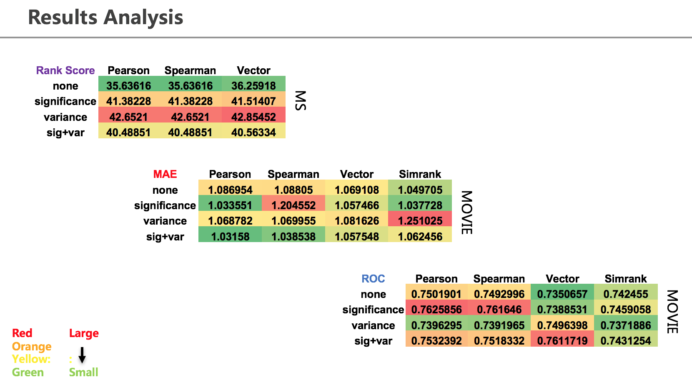

# Project 4: Collaborative Filtering

### [Project Description](doc/project4_desc.md)

Term: Fall 2017

+ Team 1
+ Projec title: Collaborative Filtering
+ Team members
	+ Huang, Christina
	+ Lin, Han
	+ Tao, Siyi
	+ Yang, Hongyang
	+ Zhao, Jing
+ Project summary: 

In this project, we used memory-based algorithm and model-based algorithm to do collaborative filtering. We use cluster model as model-based algorithm, in which all users are seperated into groups(by their preferences) and the estimation of one's preference towards new item is based on Bayes formulation. For memory-based algorithm, we use combination of different similarities: Pearson similarity, Spearman similarity, Vector similarity, Simrank similarity and different weights: variance weight, significance weight to do collaborative filtering. Following are result analysis of different combinations of memory based algorithm: 

	
**Contribution statement**: 

Huang, Christina: implementation of cluster model, optimization of cluster model parameters

Lin, Han: implementation of simrank, pearson similarity, spearman similarity, vector similarity, rank score evaluation

Tao, Siyi: variance weighting, significance weighting, ROC evaluation, main.Rmd, github organization, data cleaning

Yang, Hongyang: 

Zhao, Jing: simrank, selecting neighbors, rating normalization, MAE evaluation, main.Rmd, presentation, data cleaning

Following [suggestions](http://nicercode.github.io/blog/2013-04-05-projects/) by [RICH FITZJOHN](http://nicercode.github.io/about/#Team) (@richfitz). This folder is orgarnized as follows.

```
proj/
├── lib/
├── data/
├── doc/
├── figs/
└── output/
```

Please see each subfolder for a README file.
